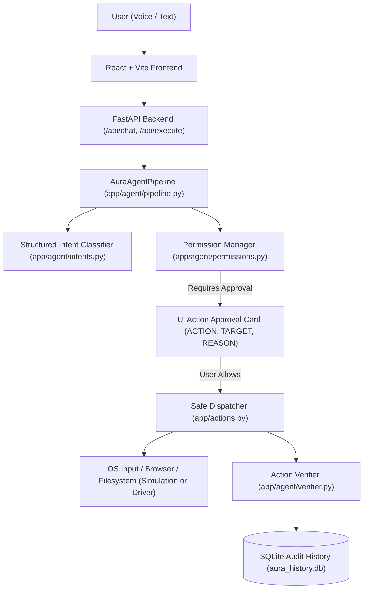

# AURA AI — Multilingual Voice & Desktop AI Computer Agent

**AURA AI** is a safe, permission-governed AI desktop computer agent designed to understand natural spoken or typed user requests, visually inspect the screen, diagnose errors, search the live web, plan computer tasks, and safely execute them with strict user confirmation.

---

## 🚀 Key Features

1. **Unified Agent Pipeline (Stage 8)**:
   - Complete end-to-end workflow: `User Input` → `Intent Detection` → `Action Planning` → `Safety Check` → `Permission Check` → `User Confirmation` → `Action Execution` → `Result Verification` → `Response` → `History Logging`.
   - Guaranteed zero arbitrary shell or remote script execution.
2. **Centralized Permission Tiers**:
   - **SAFE**: Read-only queries, chat, screenshot capture, file searches, screen inspections.
   - **CONFIRM**: Mouse clicks, typing, key presses, window scrolls, opening applications, folder creation, browser navigation.
   - **HIGH RISK**: File deletion, outbound phone calls, WhatsApp/Messenger messages, system setting alterations. Never auto-executes.
3. **Multilingual & Mixed-Language Support**:
   - Full support for **English**, **Bengali (বাংলা)**, **Hindi (हिन्दी)**, and mixed-language commands (Banglish & Hinglish):
     - *"Google e DAA merge sort search koro"* → `WEB_SEARCH`
     - *"Chrome kholo"* → `OPEN_APPLICATION`
     - *"Ei error ta ki?"* → `ANALYZE_ERROR`
     - *"Find my notes.txt file"* → `FIND_FILE`
4. **Safe File & Folder Assistant**:
   - Sandboxed operations within user home and workspace roots (`Path.home()`, `Documents`, etc.).
   - Path traversal defense: blocks illegal `..` escapes and access to critical system folders (`C:\Windows`, `/etc`).
   - Create folders, search files, read text files, generate content summaries, rename and move files safely.
   - Deletion strictly gated by user confirmation.
5. **Safe Browser Automation**:
   - Automated URL navigation, search dispatch, and browser launching.
   - Rigorous URL sanitization: blocks dangerous protocols (`javascript:`, `file:`, `data:`) and sensitive banking/login domains.
6. **Screen Awareness & Error Vision (Stages 6 & 7)**:
   - In-memory primary screen capture via Pillow (zero permanent disk storage by default for privacy).
   - Vision diagnostics identifying active windows, visible syntax errors, and compiler failures.
   - Cautious wording (*"This appears to be...", "The likely cause is..."*) preventing unwarranted certainty.
7. **Guarded UI Automation**:
   - Targeted clicks (by coordinate or element description), keyboard text typing, navigation key presses (`Enter`, `Tab`, `Escape`, arrow keys), and vertical scrolling.
   - Explicit defense blocking dangerous keys (`ctrl+alt+del`, `win+l`, `alt+f4`).
8. **AI Coding Assistant**:
   - Structured diagnostics for Python and multi-language errors: identifies Problem, Why it happens, and Suggested Fix without executing code.
9. **Action Verification Engine**:
   - Post-execution verification checking concrete evidence (file existence, process launch, URL validity) before declaring success.
10. **Persistent SQLite Audit History**:
    - Complete action log storing timestamp, original command, detected intent, planned action, confirmation status, execution status, evidence, and language.

---

## 🛠️ Architecture & Tech Stack



- **Backend**: Python 3.10+, FastAPI, Uvicorn, Pydantic v2, SQLite3, Pillow (optional for live screen vision), Requests.
- **Frontend**: React 18, Vite, Vanilla CSS design system (dark glassmorphic UI, responsive layouts).
- **Audio/Voice**: Web Speech API (SpeechRecognition + SpeechSynthesis) with backend pyttsx3 fallback.

---

## 🏃 How to Run

### 1. Backend Setup

```bash
cd backend

# Create & activate virtual environment (optional but recommended)
python -m venv .venv
.venv\Scripts\activate      # Windows
# source .venv/bin/activate # Linux/macOS

# Install dependencies
pip install -r requirements.txt

# Start FastAPI development server
uvicorn app.main:app --reload --host 127.0.0.1 --port 8000
```

Backend health check will be available at: `http://127.0.0.1:8000/health`

### 2. Frontend Setup

```bash
cd frontend

# Install node dependencies
npm install

# Start Vite development server
npm run dev
```

Open your browser to: `http://localhost:5173`

---

## 🔐 Environment Variables

Create a `.env` file in `backend/` based on `backend/.env.example`:

```env
# Optional: OpenAI API Key for advanced multimodal reasoning
OPENAI_API_KEY=

# Optional: Tavily API Key for external web search
TAVILY_API_KEY=

# Application Host and Port
HOST=127.0.0.1
PORT=8000
```

*Note: AURA AI operates with full offline capabilities, rule-based interpreters, simulation mode, and local heuristics even when API keys are not provided.*

---

## 🛡️ Safety Model

1. **Zero Unconfirmed Mutations**: Any action that creates, renames, moves, deletes files, types keyboard input, clicks the screen, opens applications, or makes calls strictly requires user confirmation.
2. **Path Sandboxing**: File operations are strictly confined to user directories (`Documents`, `Pictures`, workspace). Access to system directories (`C:\Windows`, `/etc`) is strictly rejected.
3. **URL & Navigation Protection**: Protocol exploits (`javascript:`, `file:`, `data:`) and financial domains (`paypal.com`, `chase.com`, `accounts.google.com`) are blocked from automation.
4. **Dangerous Key Blocking**: Keystrokes like `ctrl+alt+del`, `win+l`, and `alt+f4` are blocked from automated input.
5. **No Hallucinated Success**: The action verification engine verifies files on disk or process dispatches before reporting success.

---

## 🧪 Testing Instructions

Run the dedicated test suites from the `backend/` directory:

```bash
cd backend

# Stage 8 Comprehensive Agent Core Tests
python test_stage8_agent.py

# Stage 7 Safe UI Interaction Tests
python test_stage7_ui.py

# Stage 6 Screen Awareness Foundation Tests
python test_stage6_screen.py

# Stage 5 Web Intelligence Tests
python test_stage5_web.py

# Stage 4 Brain & Context Tests
python test_stage4_brain.py

# Stage 3 Communication Tests
python test_stage3_comm.py

# Stage 2 OS Core Verification Tests
python test_stage2.py
```

---

## 💡 Example Commands

| Command | Detected Intent | Action & Risk Tier |
|---|---|---|
| `"Open Chrome"` | `OPEN_APPLICATION` | `open_application` (CONFIRM) |
| `"Google e DAA merge sort search koro"` | `WEB_SEARCH` | `web_search_browser` (CONFIRM) |
| `"Ei error ta ki?"` | `ANALYZE_ERROR` | `analyze_screen` (SAFE) |
| `"Find my notes.txt file"` | `FIND_FILE` | `find_file` (SAFE) |
| `"Why is this Python code giving an error?"` | `HELP_WITH_CODE` | `analyze_code_or_error` (SAFE) |
| `"Click the submit button"` | `CLICK` | `click_screen` (CONFIRM) |
| `"Press Enter"` | `PRESS_KEY` | `press_key` (CONFIRM) |
| `"Scroll down 5 steps"` | `SCROLL` | `scroll_screen` (CONFIRM) |
| `"Delete old_logs.txt"` | `DELETE_FILE` | `delete_file` (HIGH RISK) |
| `"Call Riya from my phone"` | `CALL_CONTACT` | `call_contact` (HIGH RISK) |

---

## ⚠️ Current Limitations

- **Complex Login/Auth**: AURA AI deliberately does not automate banking, passwords, or multi-factor authentication for user security.
- **Display Resolution**: Multi-monitor spanning uses primary display capture by default.
- **Third-Party Integrations**: WhatsApp and Instagram actions use desktop URL handlers or safe protocol launchers; full direct API integration requires platform OAuth setup.
